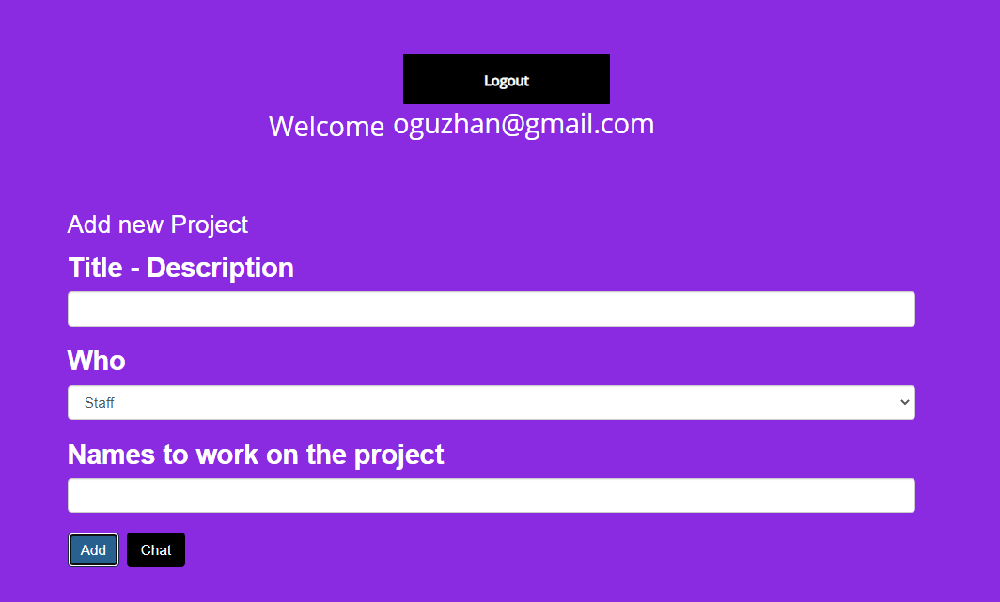
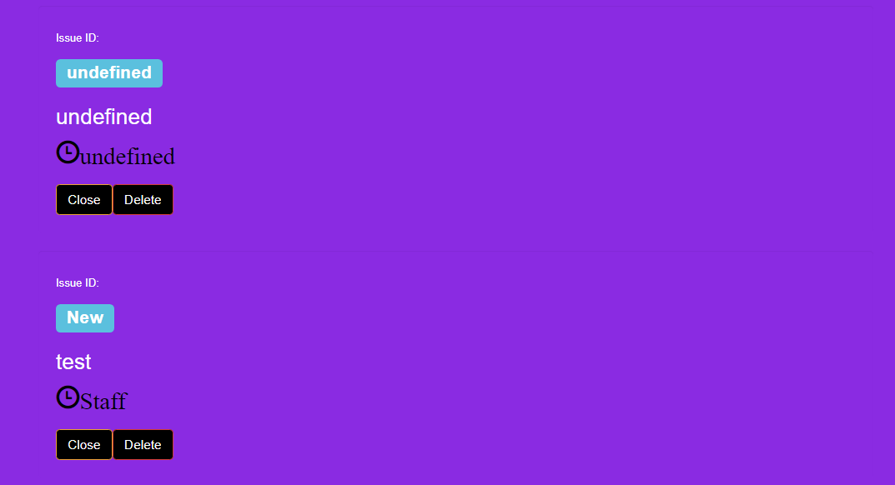

# Project-Helper
It is an application that allows you to create a project as a local project with user registration and user login with the project helper, which is a project management tool that helps to manage projects, and is shared when the codes are added.
## Badges

Use it as you want

  
## Used technologies

**Client:** Pure Js, Bootstrapt, CSS3
**Server:** Firebas, Lochal-Storage, HTML%
## Making
- Ease of Use.
- HTML page
- Pure JS
- Use of firebas
- use of bootstrapt
- use of lochal-storage

## Screenshots

## Web App in Web Site
http://oguzhancart.likesyou.org/

## For Support
For support, send an email to oguzhancart1@gmail.com or you are invited to our telegram channel https://t.me/vsform_tr  

## Codpen.io
[Codpen account link](https://codepen.io/oguzhan1881)
## Github Account Link
[Github account link](https://github.com/oguzhan18)
## Mail
oguzhancart1@gmail.com
# Instagram Account Link

